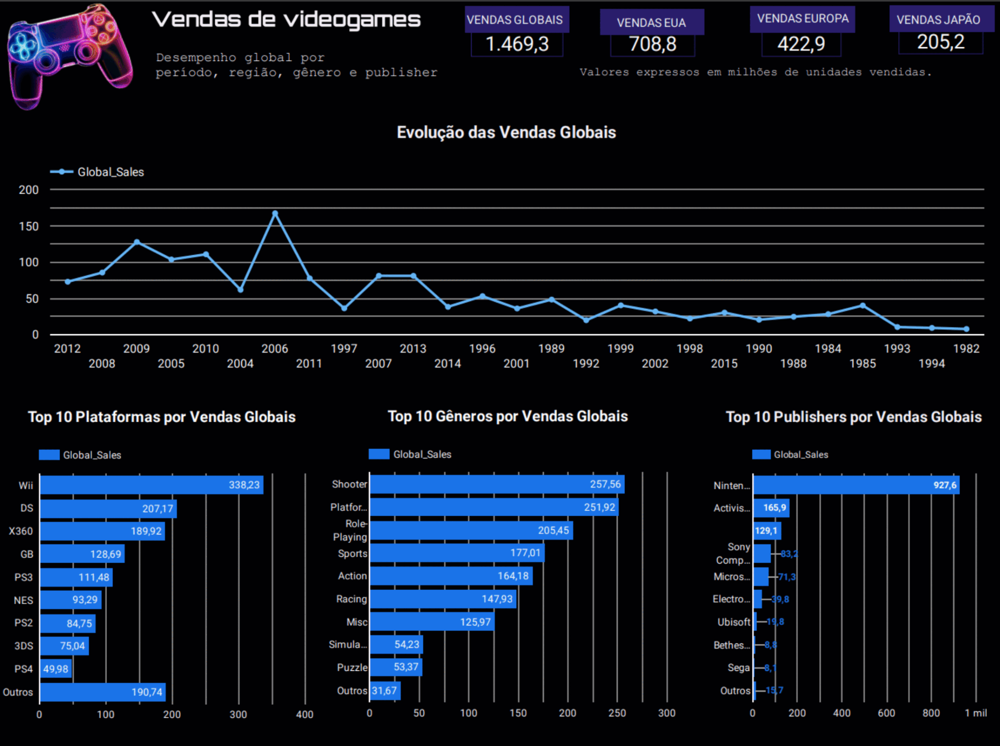

# Dashboard de Vendas de Videogames | Looker Studio

Projeto de Business Intelligence desenvolvido para analisar o desempenho global de vendas de videogames por período, região, plataforma, gênero e publisher.



## Dashboard interativo

[Acessar o dashboard no Looker Studio](https://datastudio.google.com/reporting/166abfdb-0d4b-48ed-97b4-28830b7c5972/page/p_3hnsp7zt6d)

## Objetivo

Transformar uma base de vendas de videogames em informações visuais e acionáveis, permitindo identificar padrões de mercado, líderes de desempenho e diferenças regionais.

## Indicadores principais

| Indicador | Resultado |
| --- | ---: |
| Vendas globais | 1.469,3 milhões |
| Vendas na América do Norte | 708,8 milhões |
| Vendas na Europa | 422,9 milhões |
| Vendas no Japão | 205,2 milhões |
| Registros analisados | 101 |

## Principais análises

- A América do Norte concentra aproximadamente 48% das vendas globais analisadas.
- O Wii lidera entre as plataformas, com 338,23 milhões de unidades.
- Shooter é o gênero com maior volume, alcançando 257,56 milhões de unidades.
- Nintendo lidera entre as publishers, com 927,59 milhões de unidades.
- Os resultados evidenciam diferenças relevantes de preferência entre regiões, plataformas e gêneros.

## Ferramentas utilizadas

- Looker Studio
- Google Planilhas
- CSV
- Modelagem de indicadores
- Visualização e análise de dados

## Estrutura do repositório

```text
dashboard-looker/
├── dados/
│   └── games_dashboard.csv
├── imagens/
│   └── dashboard-vendas-videogames.png
├── relatorio/
│   └── dashboard-vendas-videogames.pdf
└── README.md
```

## Campos da base

| Campo | Descrição |
| --- | --- |
| Rank | Posição do jogo no ranking |
| Name | Nome do jogo |
| Platform | Plataforma |
| Year | Ano de lançamento |
| Genre | Gênero |
| Publisher | Empresa publicadora |
| NA_Sales | Vendas na América do Norte |
| EU_Sales | Vendas na Europa |
| JP_Sales | Vendas no Japão |
| Other_Sales | Vendas em outras regiões |
| Global_Sales | Vendas globais |

Os valores de vendas estão expressos em milhões de unidades.

## Autor

Leandro Gomes  
[GitHub](https://github.com/leandroanalytics) | [Dashboard interativo](https://datastudio.google.com/reporting/166abfdb-0d4b-48ed-97b4-28830b7c5972/page/p_3hnsp7zt6d)
